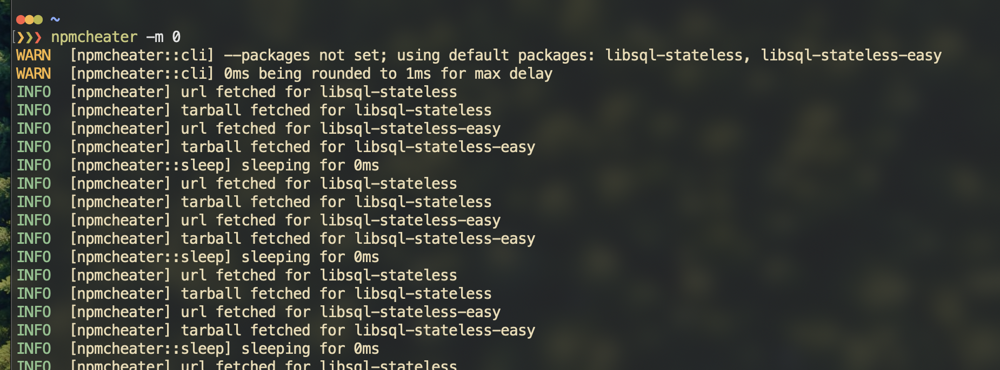

# npmcheater
Artificially bump the downloads of an npm package.

## Installing

### Install from Crates.io
Have Cargo Installed.
```bash
# have cargo installed
cargo install npmcheater
```

### Build it yourself
Have Cargo Installed.
```bash
# have git installed
git clone https://github.com/DaBigBlob/npmcheater.git
cd npmcheater
#have cargo installed
cargo build --release
./target/release/npmcheater
# do whatever you will ^this binary
```

## Usage
```txt
Usage: npmcheater [OPTIONS]

Options:
  -s, --silent                  No output
  -p, --packages <PACKAGES>     Packages to bump downloads of
  -m, --max-sleep-mili <DELAY>  Maximum delay between two fetches in miliseconds
  -h, --help                    Print help
  -V, --version                 Print version
```

## Example
`user@host ~# npmcheater -p libsql -p base64-js -p discord.js -m 5000 -s true`

